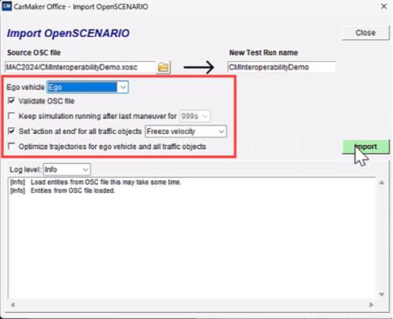
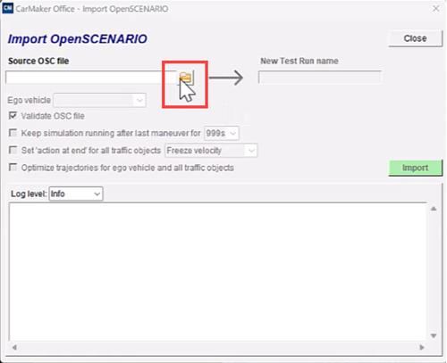
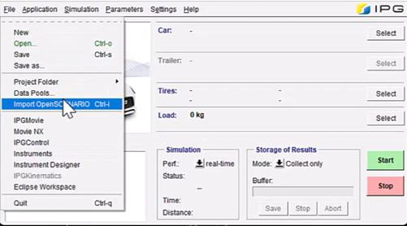

# aBaja 2026 — Software Virtual World Scenarios

This repository contains the **mandatory scenarios** for the aBaja 2026 Software Virtual World event. Each scenario is provided in formats compatible with multiple simulation platforms — you do not need to build the scenarios yourself.

---

## Table of Contents

1. [Repository Structure](#repository-structure)
2. [Scenario Overview](#scenario-overview)
3. [File Types Explained](#file-types-explained)
4. [Using Scenarios in RoadRunner](#using-scenarios-in-roadrunner)
5. [Using Scenarios in IPG CarMaker](#using-scenarios-in-ipg-carmaker)
6. [Getting Help](#getting-help)

---

## Repository Structure

```
SoftwareVirtualWorldScenarios/
└── Mandatory_Scenarios/
    ├── AEB/          ← Autonomous Emergency Braking scenario
    ├── LKA/          ← Lane Keeping Assist scenario
    └── Endurance/    ← Endurance (full autonomous) scenario
```

Each scenario folder contains:
- A video preview (`.mp4`)
- RoadRunner native files (`.rrscene`, `.rrscenario`)
- OpenSCENARIO / OpenDRIVE files for other simulators (`_IPG.xosc`, `_IPG.xodr`, `_IPG.osgb`, `.geojson`)
- A `README.md` with the full scenario specification

---

## Scenario Overview

| Scenario | Event | Description | Ego Start Speed | Traffic |
|---|---|---|---|---|
| [AEB](Mandatory_Scenarios/AEB/README.md) | Autonomous Emergency Braking | Target vehicle cuts in from adjacent lane then brakes hard | 0 km/h (accelerates to 30 km/h) | 1 vehicle (NCAP target) |
| [LKA](Mandatory_Scenarios/LKA/README.md) | Lane Keeping Assist | Ego vehicle navigates a curved road alone | 0 km/h (accelerates to 30 km/h) | None |
| [Endurance](Mandatory_Scenarios/Endurance/README.md) | Endurance / Full Autonomous | Ego vehicle navigates a 1 km road; pedestrian crosses ahead | 30 km/h (constant) | 1 pedestrian (NCAP) |

---

## File Types Explained

| Extension | What it is | Used by |
|---|---|---|
| `.rrscene` | RoadRunner native scene file (road geometry, environment) | RoadRunner |
| `.rrscenario` | RoadRunner native scenario file (actors, triggers, logic) | RoadRunner |
| `_IPG.xosc` | OpenSCENARIO 1.2 file — scenario description (actors, maneuvers, triggers) | IPG CarMaker, any OpenSCENARIO-compatible tool |
| `_IPG.xodr` | OpenDRIVE file — road network geometry | IPG CarMaker, any OpenDRIVE-compatible tool |
| `_IPG.osgb` | OpenSceneGraph binary — 3D visual mesh of the road environment | IPG CarMaker |
| `.geojson` | GeoJSON road data — for GIS tools or custom importers | General purpose |
| `.mp4` | Video preview of the scenario | Reference only |

> **Rule of thumb:** For RoadRunner, use `.rrscene` + `.rrscenario`. For IPG CarMaker (and other OpenSCENARIO tools), use the `_IPG.xosc` + `_IPG.xodr` + `_IPG.osgb` set.

---

## Using Scenarios in RoadRunner

> **Prerequisites:** RoadRunner must be installed and a RoadRunner project must already exist. If you haven't set one up, refer to the [SoftwareVirtualWorldSimulation README](https://github.com/aBaja-2026/SoftwareVirtualWorldSimulation).

### Step 1 — Copy the scene and scenario files

Copy the files for the scenario you want to run into your RoadRunner project:

- Copy the `.rrscene` file → `<YOUR_RR_PROJECT>/Scenes/`
- Copy the `.rrscenario` file → `<YOUR_RR_PROJECT>/Scenarios/`

**Example for AEB:**
```
AEB.rrscene      → D:\MyRRProject\Scenes\AEB.rrscene
AEB.rrscenario   → D:\MyRRProject\Scenarios\AEB.rrscenario
```

### Step 2 — Open the scene in RoadRunner

1. Open RoadRunner
2. Go to **File → Open Scene**
3. Select the `.rrscene` file you copied (e.g. `AEB.rrscene`)

### Step 3 — Open the scenario into the scene

1. Switch to the **Scenario** tab in RoadRunner
2. Go to **File → Open Scenario into Current Scene**
3. Select the matching `.rrscenario` file (e.g. `AEB.rrscenario`)

You should now see the road and all actors (vehicles, pedestrians) placed and ready.

### Step 4 — Attach SLbehaviour to the Ego Vehicle *(if co-simulating with MATLAB/Simulink)*

If you want to connect your Simulink algorithm to this scenario:

1. Click on the **Ego Vehicle** in the scenario to select it
2. In the properties panel, attach the `SLbehaviour` behaviour (see the [SoftwareVirtualWorldSimulation README](https://github.com/aBaja-2026/SoftwareVirtualWorldSimulation) for how to create this behaviour)

> If you just want to watch the pre-defined scenario play out without Simulink, you can skip this step.

### Step 5 — Run the scenario

Go to the **Simulation** tab and click **Play**.

> **Note:** The Ego Vehicle must have **Ego Actor ID = 1** for the Simulink co-simulation to work correctly.

---

## Using Scenarios in IPG CarMaker

> **Prerequisites:** IPG CarMaker must be installed. No RoadRunner installation is needed for this workflow.

### Files you need (pick the scenario folder)

| Scenario | Use these files |
|---|---|
| AEB | `AEB_IPG.xosc`, `AEB_IPG.xodr`, `AEB_IPG.osgb` |
| LKA | `LKA_IPG.xosc`, `LKA_IPG.xodr`, `LKA_IPG.osgb` |
| Endurance | `Endurance_IPG.xosc`, `Endurance_IPG.xodr`, `Endurance_IPG.osgb` |

Keep all three files in the **same folder** — the `.xosc` file references the `.xodr` and `.osgb` files by relative path and they must stay together.

### Step 1 — Open CarMaker

Launch IPG CarMaker.

### Step 2 — Import the OpenSCENARIO file

Go to **File → Import OpenSCENARIO**:



### Step 3 — Select the `.xosc` file

In the Import OpenSCENARIO window, click the folder icon next to the **Source OSC file** field and browse to the `_IPG.xosc` file for your chosen scenario:



### Step 4 — Configure import options

Set the following options in the Import window:

| Option | Value |
|---|---|
| **Ego vehicle** | `Ego` |
| **Validate OSC file** | ✅ Checked |
| **Set 'action at end' for all traffic objects** | `Freeze velocity` |

> **Why "Freeze velocity"?** This prevents traffic actors from continuing to move indefinitely after their scripted maneuver ends. Without this, traffic vehicles may drift off-road once the scenario logic completes.

### Step 5 — Click Import

Click **Import**. CarMaker will load the road network, place all actors at their starting positions, and configure the maneuver logic. Once complete, you can close the Import OpenSCENARIO window.

### Step 6 — Run the simulation

Click the **Start** button in the lower right corner of the CarMaker workspace to run the simulation:



> **No co-simulation required.** IPG CarMaker runs the scenario fully independently — there is no need to have RoadRunner or MATLAB/Simulink running at the same time.

---

## Getting Help

If you run into issues not covered by this README or the individual scenario READMEs, post in the **Discussions tab** of this repository. Include the scenario name, the simulator you're using, and the exact error message.
